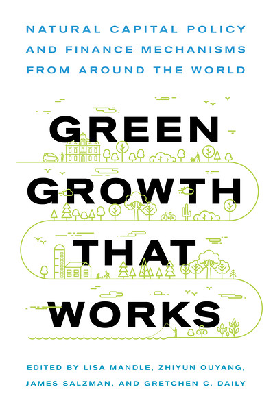

# Green Growth Explorer: Natural Capital Policy and Finance Mechanisms around the World

## The Book _Green Growth That Works_
The book [Green Growth That Works](https://islandpress.org/books/green-growth-works) is the first practical guide to bring together pragmatic finance and policy tools that can make investment in natural capital both attractive and commonplace. Here, you can explore the real-world case studies featured in the book. These examples show how governments, businesses, NGOs and other groups are channeling economic resources towards conservation and restoration, for the benefit of people and nature. Click the question mark button on the right get a quick tutorial on navigating this site.

To learn more about the featured case studies, you can purchase Green Growth That Works from [Island Press](https://islandpress.org/books/green-growth-works) (and use discount code GROWTH for 20% off), Amazon, or your favorite bookstore.

## The Green Growth Explorer

This Green Growth Explorer Application gives an overview of the book, and a deep dive in some cases data - users can explore by book chapters or mechanism types (make selections on the left, or read tutorial).

## Contributors

- Charlotte Gisèle Weil | Project lead | Correspondence & suggestions to chweil@stanford.edu |
- Cyril van Schreven | Contributing designer & developer 
- Günes Yurdakul | Contributing designer & developer 
- Can Yilmaz Altinigne | Contributing designer & developer 

